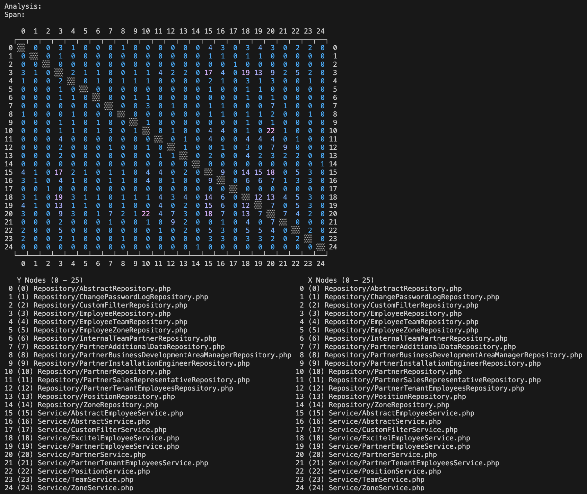
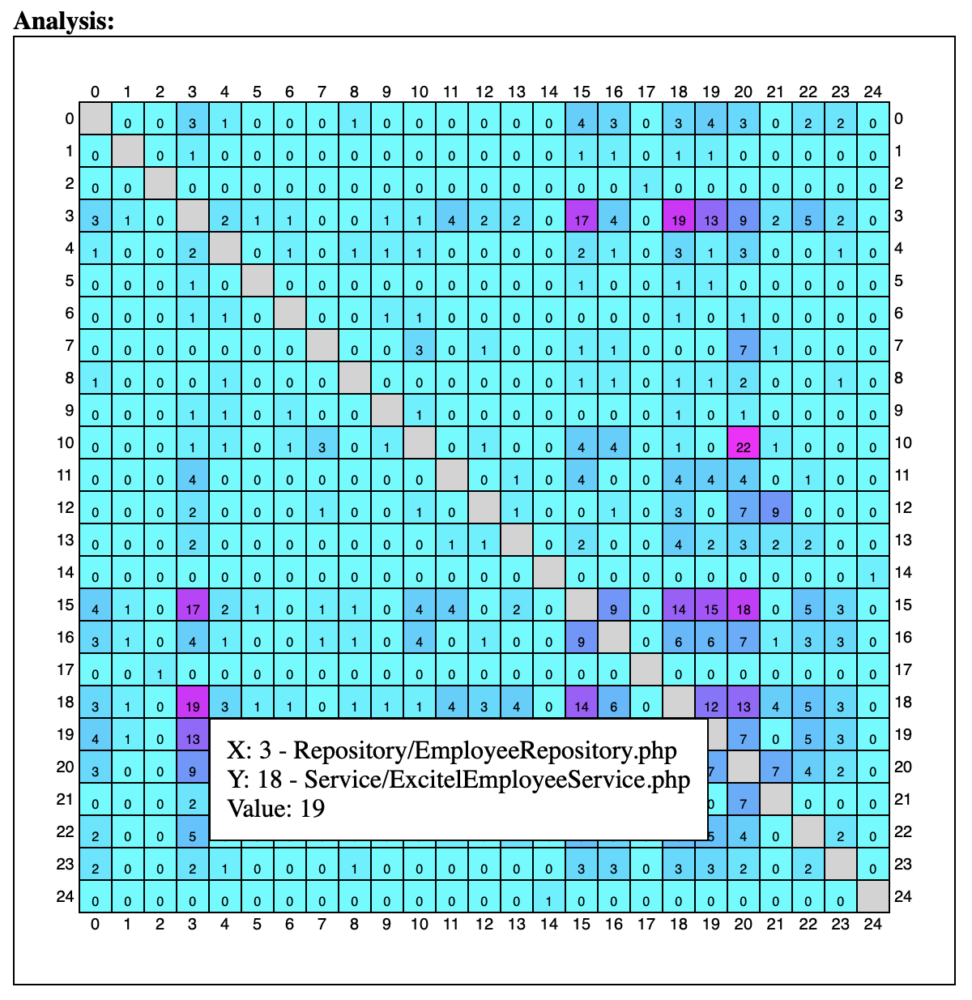
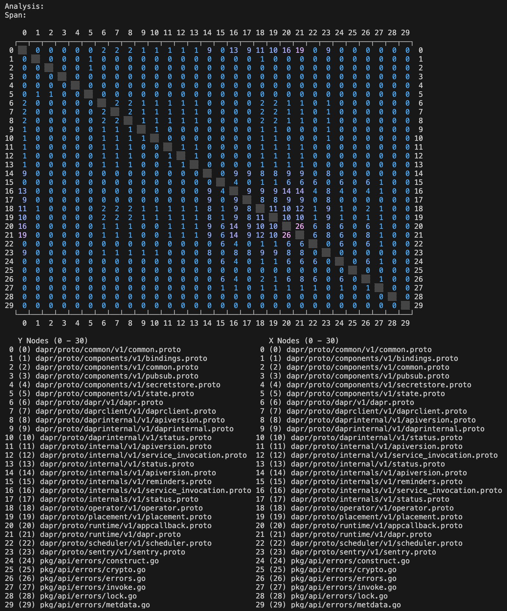
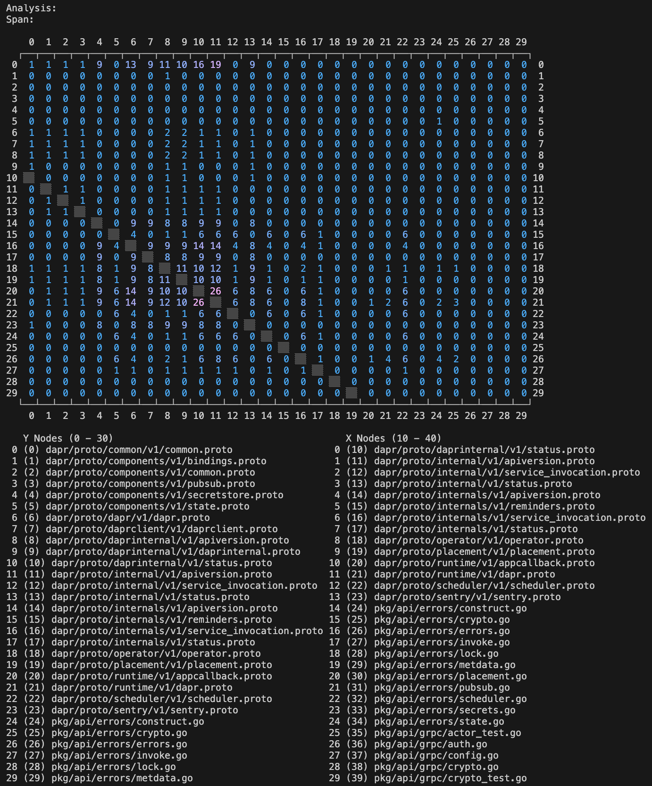
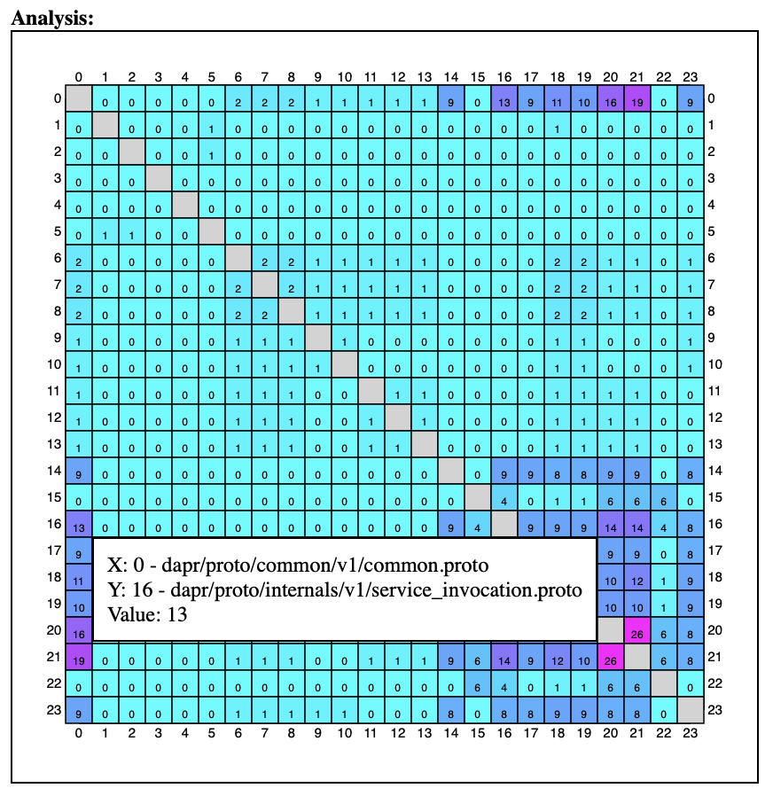

# Osmium

This is a prototype tool for exploring the dependencies between elements in a software system module by analyzing the evolution of the source files that contain these elements.

## Overview

Osmium uses the DSM ([Design Structure Matrix](https://en.wikipedia.org/wiki/Design_structure_matrix)) methods to measure and visualize the cohession between files in a GitHub repository by tracking how often these files were changed together in a logical units like Git commits or GitHub pull requests. Each number in the matrix represents the number of times the X-axis file was changed along with the Y-axis file in the same commit or pull request. Osmium is implemented as a CLI application with commands for generating analyses and building different views (presentations) on them. It is also available as a [GitHub CLI extension](https://github.com/zdrgeo/gh-osmium).

Analysis View in terminal



Analysis View in web browser



## Quick start

Analyse [Dapr](https://github.com/dapr/dapr) GitHub repository. Store the generated analysis model to the user home directory under the name "dapr". Be patient - this operation may take several minutes to complete.
```shell
osmium analysis github create \
    --analysis-name="dapr" \
    --repository-owner="dapr" \
    --repository-name="dapr" \
    --change="pullrequest" \
    --change-option="after=0,until=100"
```

Generate a view scoped to the "\*.proto" files in the "dapr" directory and the "\*.go" files in the "cmd", "pkg" and "utils" directories. Store the generated view model to the user home directory under the name "dapr".
```shell
osmium view create \
    --analysis-name="dapr" \
    --view-name="dapr" \
    --node-name="^dapr(/[^/]+)*/[^/]+\.proto$" \
    --node-name="^cmd(/[^/]+)*/[^/]+\.go$" \
    --node-name="^pkg(/[^/]+)*/[^/]+\.go$" \
    --node-name="^utils(/[^/]+)*/[^/]+\.go$"
    --builder="pattern"
```

Render to the terminal a "window" of the first 30 files of the view.
```shell
osmium view terminal render \
    --analysis-name="dapr" \
    --view-name="dapr" \
    --node-count=30
```


Render to the terminal a "window" of 30 files of the view offseted 10 files to the right on the X axis. This allows for "scrolling" of the view, which often contains more files than can be displayed at once in the terminal.
```shell
osmium view terminal render \
    --analysis-name="dapr" \
    --view-name="dapr" \
    --x-node-start=10
    --node-count=30
```


Generate another view scoped only to the "\*.proto" files in the "dapr" directory. Store the generated view model to the user home directory under the name "api".
```shell
osmium view create \
    --analysis-name="dapr" \
    --view-name="api" \
    --node-name="^dapr(/[^/]+)*/[^/]+\.proto$"
    --builder="pattern"
```

Render to an HTML file the whole view and start listening for HTTP requests.
```shell
osmium view web-browser render \
    --analysis-name="dapr" \
    --view-name="api"

osmium view web-browser listen \
    --analysis-name="dapr" \
    --view-name="api"
```

Open [http://localhost:3000/view.html](http://localhost:3000/view.html) in a web browser.



## Concepts

- Analysis
- Modules
- Spans and Changes
- Nodes and Edges
- Views

The data model can be built based on data from various sources. When GitHub Pull Request source is used, Osmium iterates over all pull requests. When Git Commit source is used, Osmium iterates over all commits.

## Usage

### Workflow

Osmium's workflow is organized into three stages: generate an analysis, generate at least one view of the analysis, explore the views.
The output of each stage is persisted and can be used mutiple times as input for the next stage. This enables iterative style of work - each stage can be repeated with the same input, but with different parameters to produce differenet outputs for the next stage. This also helps with time- and resource-intensive stages such as the analysis generation, where multiple API calls (which may also be subject of rate limits) are often required to obtain the necessary historical data from the source.

### Configuration

```dotenv
# config.env

BASEPATH=
SOURCE=github:pullrequest
GITHUB_TOKEN=
```

### Commands to manipulate the DSM analyses

```
osmium analysis github create
    --analysis-name -a
    --change -c {pullrequest}
    [--change-option -o]
    --span-size -s
    --repository-owner
    --repository-name
```
| Parameter | Default | Optional | Description |
|--|--|--|--|
| --analysis-name -a | | | Name of the analysis. |
| --change -c | pullrequest | | Change of the analysis - pull request. |
| --change-option -o | | Yes | Options of the change. Reserved for future use. |
| --span-size -s | | Yes | Size of the span. |
| --repository-owner | | | Owner of the GitHub repository. |
| --repository-name | | | Name of the GitHub repository. |

```
osmium analysis git create
    --analysis-name -a
    --change -c {commit}
    [--change-option -o]
    --span-size -s
    --repository-url
    --repository-path
```
| Parameter | Default | Optional | Description |
|--|--|--|--|
| --analysis-name -a | | | Name of the analysis. |
| --change -c | commit | | Change of the analysis - commit. |
| --change-option -o | | Yes | Options of the change. Reserved for future use. |
| --span-size -s | | Yes | Size of the span. |
| --repository-url | | | URL of the Git repository. |
| --repository-path | | | Path of the Git repository. |

```
osmium analysis github change
    --analysis-name -a
    --change -c {pullrequest}
    [--change-option -o]
    --span-size -s
    --repository-owner
    --repository-name
```
| Parameter | Default | Optional | Description |
|--|--|--|--|
| --analysis-name -a | | | Name of the analysis. |
| --change -c | pullrequest | | Change of the analysis - pull request. |
| --change-option -o | | Yes | Options of the change. Reserved for future use. |
| --span-size -s | | Yes | Size of the span. |
| --repository-owner | | | Owner of the GitHub repository. |
| --repository-name | | | Name of the GitHub repository. |

```
osmium analysis git change
    --analysis-name -a
    --change -c {commit}
    [--change-option -o]
    --span-size -s
    --repository-url
    --repository-path
```
| Parameter | Default | Optional | Description |
|--|--|--|--|
| --analysis-name -a | | | Name of the analysis. |
| --change -c | commit | | Change of the analysis - commit. |
| --change-option -o | | Yes | Options of the change. Reserved for future use. |
| --span-size -s | | Yes | Size of the span. |
| --repository-url | | | URL of the Git repository. |
| --repository-path | | | Path of the Git repository. |

```
osmium analysis delete
    --analysis-name -a
```
| Parameter | Default | Optional | Description |
|--|--|--|--|
| --analysis-name -a | | | Name of the analysis. |

#### Examples

Generate an analysis model using the GitHub repository with owner 'scaleforce' and name 'tixets' as a source. Store the generated analysis model to the user home directory under the name "ticketing_tixets".
```
osmium analysis github create \
    --analysis-name="ticketing_tixets" \
    --repository-owner="scaleforce" \
    --repository-name="tixets"
```

Alter the stored analysis model with name "ticketing_tixets". Use the same GitHub repository with owner "scaleforce" and name "tixets" as a source.
```
osmium analysis github change \
    --analysis-name="ticketing_tixets" \
    --repository-owner="scaleforce" \
    --repository-name="tixets"
```

Remove the stored analysis model with name "ticketing_tixets" from the user home directory.
```
osmium analysis delete \
    --analysis-name="ticketing_tixets"
```

### Commands to manipulate the views

```
osmium view create
    --analysis-name -a
    --view-name -v
    [--node-name -n]
    --builder -b {filepath, pattern}
    [--builder-option -o]
```
| Parameter | Default | Optional | Description |
|--|--|--|--|
| --analysis-name -a | | | Name of the analysis. |
| --view-name -v | | | Name of the view. |
| --node-name -n | | Yes | Names of the nodes. |
| --builder -b | filepath | | Builder of the view - file path or RegExp pattern. |
| --builder-option -o | | Yes | Options of the builder. Reserved for future use. |

```
osmium view change
    --analysis-name -a
    --view-name -v
    [--node-name -n]
    --builder -b {filepath, pattern}
    [--builder-option -o]
```
| Parameter | Default | Optional | Description |
|--|--|--|--|
| --analysis-name -a | | | Name of the analysis. |
| --view-name -v | | | Name of the view. |
| --node-name -n | | Yes | Names of the nodes. |
| --builder -b | filepath | | Builder of the view - file path or RegExp pattern. |
| --builder-option -o | | Yes | Options of the builder. Reserved for future use. |

```
osmium view delete
    --analysis-name -a
    --view-name -v
```
| Parameter | Default | Optional | Description |
|--|--|--|--|
| --analysis-name -a | | | Name of the analysis. |
| --view-name -v | | | Name of the view. |

```
osmium view terminal render
    --analysis-name -a
    --view-name -v
    --span-name -s
    --x-node-start
    --y-node-start
    --node-count
```
| Parameter | Default | Optional | Description |
|--|--|--|--|
| --analysis-name -a | | | Name of the analysis. |
| --view-name -v | | | Name of the view. |
| --span-name -s | | | Name of the span. |
| --x-node-start | | | Start of the X nodes. |
| --y-node-start | | | Start of the Y nodes. |
| --node-count | | | Count of the nodes. |

```
osmium view web-browser render
    --analysis-name -a
    --view-name -v
    --span-name -s
```
| Parameter | Default | Optional | Description |
|--|--|--|--|
| --analysis-name -a | | | Name of the analysis. |
| --view-name -v | | | Name of the view. |
| --span-name -s | | | Name of the span. |

```
osmium view web-browser listen
    --analysis-name -a
    --view-name -v
```
| Parameter | Default | Optional | Description |
|--|--|--|--|
| --analysis-name -a | | | Name of the analysis. |
| --view-name -v | | | Name of the view. |

```
osmium view csv render
    --analysis-name -a
    --view-name -v
    --span-name -s
```
| Parameter | Default | Optional | Description |
|--|--|--|--|
| --analysis-name -a | | | Name of the analysis. |
| --view-name -v | | | Name of the view. |
| --span-name -s | | | Name of the span. |

```
osmium view png render
    --analysis-name -a
    --view-name -v
    --span-name -s
```
| Parameter | Default | Optional | Description |
|--|--|--|--|
| --analysis-name -a | | | Name of the analysis. |
| --view-name -v | | | Name of the view. |
| --span-name -s | | | Name of the span. |

#### Examples

Generate a view model based on the analysis with name "ticketing_tixets". Store the generated view model to the user home directory under the name "app". Scope the view model to nodes with names that match any of the the file paths "app/Controller/\*.php", "app/Service/\*.php" or "app/Repository/\*.php".
```
osmium view create \
    --analysis-name="ticketing_tixets" \
    --view-name="app" \
    --node-name="app/Controller/*.php" \
    --node-name="app/Service/*.php" \
    --node-name="app/Repository/*.php"
```

Alter the stored view model with name "app" based on the analysis with name "ticketing_tixets". Scope the view to the same nodes.
```
osmium view change \
    --analysis-name="ticketing_tixets" \
    --view-name="app" \
    --node-name="app/Controller/*.php" \
    --node-name="app/Service/*.php" \
    --node-name="app/Repository/*.php"
```

Remove the stored view model with name "app" based on the analysis with name "ticketing_tixets" from the user home directory.
```
osmium view delete \
    --analysis-name="ticketing_tixets" \
    --view-name="app"
```

Render the stored view model with name "app" based on the analysis with name "ticketing_tixets" to the terminal.
```
osmium view terminal render \
    --analysis-name="ticketing_tixets" \
    --view-name="app"
    --x-node-start=80
    --y-node-start=20
    --node-count=40
```

Render the stored view model with name "app" based on the analysis with name "ticketing_tixets" to HTML file.
```
osmium view web-browser render \
    --analysis-name="ticketing_tixets" \
    --view-name="app"
```

Start serving the rendered to HTML file view model with name "app" based on the analysis with name "ticketing_tixets".
```
osmium view web-browser listen \
    --analysis-name="ticketing_tixets" \
    --view-name="app"
```

Render the stored view model with name "app" based on the analysis with name "ticketing_tixets" to CSV file.
```
osmium view csv render \
    --analysis-name="ticketing_tixets" \
    --view-name="app"
```

Render the stored view model with name "app" based on the analysis with name "ticketing_tixets" to PNG file.
```
osmium view png render \
    --analysis-name="ticketing_tixets" \
    --view-name="app"
```
